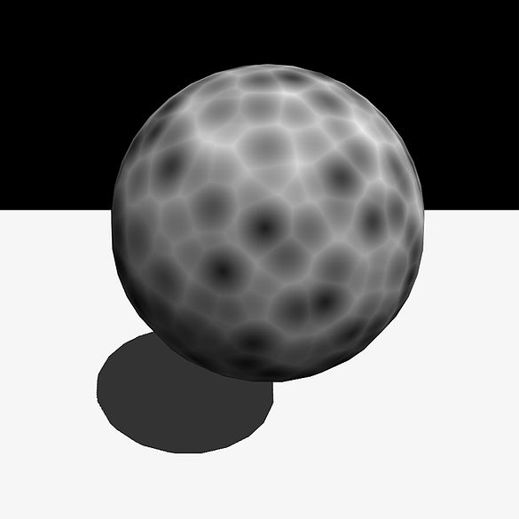

# GPU-Voronoi-Noise

In 1996 Steve Worley published a article called "A Cellular Texture Basis Function". This article outlined a method of using the math behind voronoi diagrams to create procedural noise. The method became know as Worley noise after its author but is also know as voronoi or cellular noise. At some point after this he published some code that presented a more optimized method for generating the noise.  This optimization made some assumptions about the distributions of points in each cell. In a normal voronoi diagram the distribution of points follows a poisson distribution and multiple points maybe located in each cell. In the optimized version only one point is located in each cell. This greatly simplifies the code and has little effect on the quality. I came across this optimized code last year but have unfortunately lost where I originally found it so can't provide a link.

The optimized code for 2D noise was provide and I have extended it into 3D and 4D noise. The original code was written in C and I have taken this and moved it into a shader so the computation is done on the GPU.

